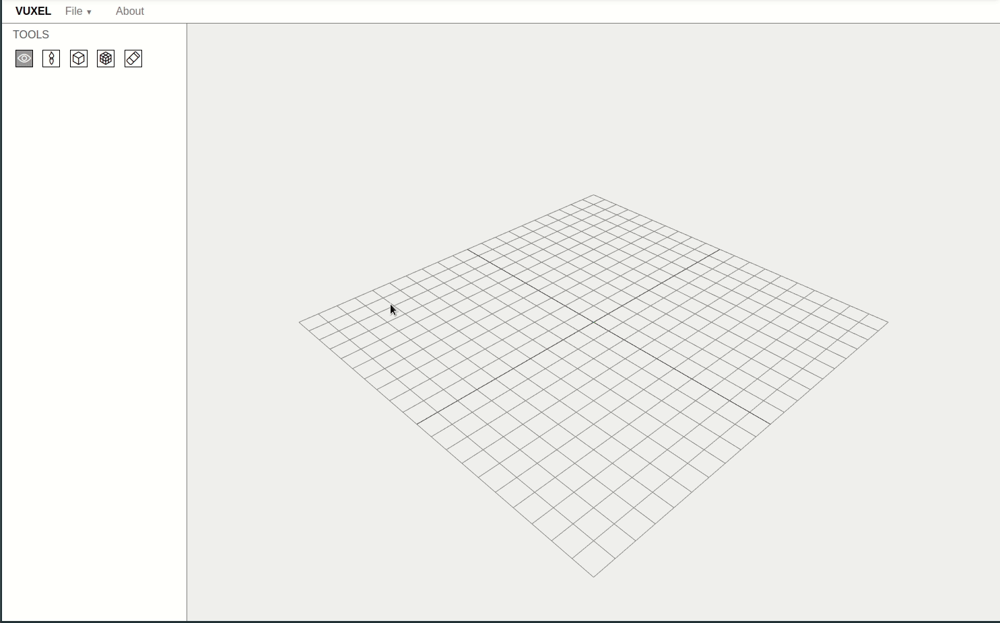

# Vuxel

[](https://travis-ci.org/Perkovec/Vuxel) [](https://greenkeeper.io/)

Version 0.0.4

By Ilya Karpuk perkovec24@gmail.com

## About

Vuxel - tool for creating 3D models using voxels.



## Install & Build

Firstly, install dependencies:
```bash
npm install
```

We are using [Parcel](https://github.com/parcel-bundler/parcel) to build Vuxel.

If you want to start dev server, run command:
```bash
npm start
```

For build project use `build` script:
```bash
npm run build
```

## Features

- [x] Camera rotation
- [x] Tool for bulk creation of voxels
- [x] Load/save models
- [x] Painting tools
- [x] Advanced color picker
- [x] Keybindings for tools
- [ ] Orientation indicator and controller
- [ ] Layers
- [ ] Dark theme (need help)
- [ ] Export models

## Licence

Vuxel is released under the MIT licence. 
